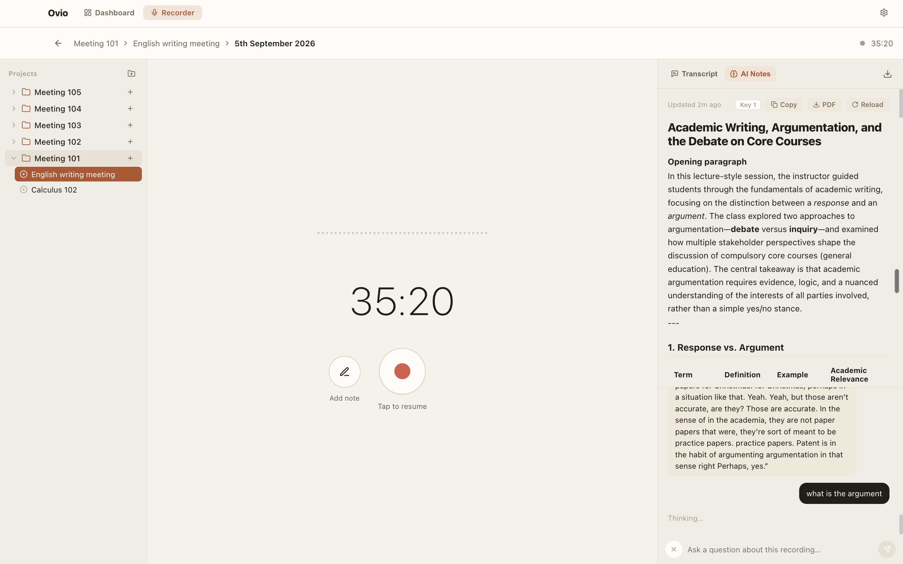

# Ovio 🎙️

**Real-time transcription & AI-powered study notes — right on your Mac.**

<p align="center">
  
  <br/>
  <em>Live recorder with a structured AI summary and the in-recording chat — ask "what is the argument?" and get a grounded answer.</em>
</p>

Ovio records your meetings, lectures, and conversations, transcribes them live, and turns them into a deep, well-structured AI summary you can actually study from. Ask the built-in chat anything about the recording — it answers from your transcript, in short and clear replies.

---

## ✨ What it does

- **Live transcription** — real-time speech-to-text while you record, with a timer and waveform.
- **Quick notes** — drop your own notes at any moment; they collect in a dedicated Notes section at the top of the transcript, never mixed into it.
- **In-depth AI summary** — your transcript is automatically turned into structured, detailed notes: a title, a short overview, one section per theme, bullets where they help, and a "Summary Points" list at the end. Nothing important is left out.
- **AI chat about the recording** — ask questions in plain language and get short, direct answers grounded in the transcript.
- **Projects & folders** — organize recordings by project and subproject; everything persists between sessions.
- **Export** — download transcript, notes, and the AI summary as a text file.

## 🔒 Privacy by design

- **Local transcription** — runs Whisper on-device (small / turbo / large models, downloaded on demand).
- **Fully local AI** — point Ovio at your own [Ollama](https://ollama.com) instance and nothing ever leaves your machine.
- **API keys stay local** — keys are encrypted (via macOS Keychain-backed safeStorage) and stored only on your device. They are never written in plaintext to disk.

## 🔑 AI providers (all optional)

| Provider | Used for | Setup |
|---|---|---|
| **Groq** | Cloud transcription + AI notes/chat | Add a free `gsk_...` key in Settings |
| **OpenRouter** | Fallback for AI notes/chat | Optional extra key |
| **Ollama** | 100% local AI notes/chat | Run `ollama serve` locally, pick it in Settings |

No keys at all? Switch to local mode — Ovio works fully offline with Whisper + Ollama.

## 🚀 Getting started

```bash
# 1. Install dependencies
npm install

# 2. Run in development (Vite + Electron)
npm run electron:dev

# 3. Build a Mac app (unsigned DMG in /release)
npm run electron:build
```

> **First launch of the packaged app:** macOS Gatekeeper will warn about an unsigned app.
> Right-click the app → **Open** → **Open** to allow it once.

> **Local STT models** are not bundled to keep the download small. Grab them in
> **Settings → Local STT Model** (Small ≈ 466 MB, Turbo ≈ 1.6 GB, Large ≈ 3.1 GB).

## 🧭 How to use

1. Create a project → a subproject → **New Recording**.
2. Hit the record button — the transcript appears live on the right.
3. Tap **✏️ Add note** anytime; your notes collect in the **NOTES** section at the top.
4. Stop when done — the **AI Notes** tab fills in with a structured in-depth summary automatically.
5. Use the **✨ chat bar** at the bottom to ask anything about the recording. Click the toggle button to hide/unhide the chat.
6. **⬇️ Download** exports everything; **⌘,** opens Settings.

## 🗂️ Project structure

```
├── electron/          # Main process: window, settings (encrypted), Whisper engine
├── src/
│   ├── MacNoteTaker.jsx   # Recorder UI: transcript, notes, AI summary, chat
│   ├── Dashboard.jsx      # Browse projects & recordings
│   ├── Onboarding.jsx     # First-run setup
│   ├── Settings.jsx       # Keys, providers, models
│   ├── context/           # Settings state (synced with the main process)
│   ├── hooks/             # Transcription, auto-summary, persistence
│   └── services/          # Groq / OpenRouter / Ollama clients (with retry)
└── models/            # Local Whisper models (downloaded on demand, gitignored)
```

## 🛠️ Tech

Electron · React 18 · Vite · whisper.cpp (local STT) · Groq / OpenRouter / Ollama APIs

## 🩹 Recent fixes (v1.2.3)

- **AI notes & chat now actually work with your key** — Groq's model is a "reasoning" model that silently spent the whole reply budget on hidden thinking and returned empty responses; Ovio now sets a low reasoning effort and retries with a larger budget, so notes and chat replies are never empty.
- **Local AI is far more robust** — if your configured Ollama model is missing, slow, or fails, Ovio automatically discovers your installed models and uses the best-suited one (general instruct models before coder/reasoning ones). `<think>…</think>` blocks from reasoning models are stripped from output.
- **Local note generation gets a realistic time budget** — up to 8 minutes with a capped output size, instead of timing out at 3.
- **Adding a cloud key now activates it** — adding a Groq/OpenRouter key while "Fully Local" was selected used to leave the app ignoring the new key; it now switches to cloud mode (Ollama remains the fallback when no key is configured).

## 🩹 Recent fixes (v1.2.2)

- **API keys no longer disappear** — keys are now encrypted with AES-256-GCM using a
  local master key that survives app updates and re-signing (older versions relied on
  macOS Keychain-bound encryption that silently broke between releases, making saved
  keys unreadable). Any key saved by a previous version is migrated automatically.
- **Settings updates can never wipe keys** — toggling, renaming, or saving settings
  previously rewrote the key list and destroyed stored values; the merge now preserves
  every stored key.
- **No more dropped audio while transcribing** — recording chunks are queued and
  processed one by one (previously any chunk arriving during a slow cloud request was
  discarded, leaving gaps in the transcript).
- **Smarter fallbacks** — hybrid mode falls back to cloud transcription whenever the
  local engine fails (not just when it returns empty), and cloud transcription rotates
  across all your active Groq keys with 429-aware retries.
- **Better local AI** — Ollama requests keep the model warm (instant repeat calls),
  use a larger 8192-token context window so long transcripts fit, and retry transient
  daemon errors with clear timeout messaging.
- **Duplicate-key protection** — re-running onboarding or adding a key you already
  saved no longer creates duplicate entries.

---

Made with ❤️ by the team at **Snippetz Labs**
