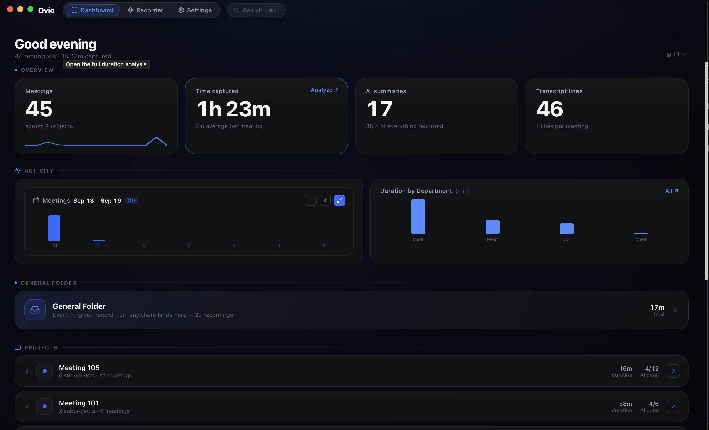
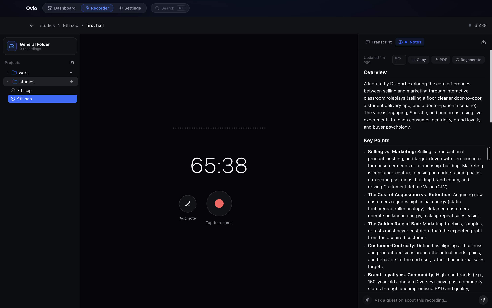
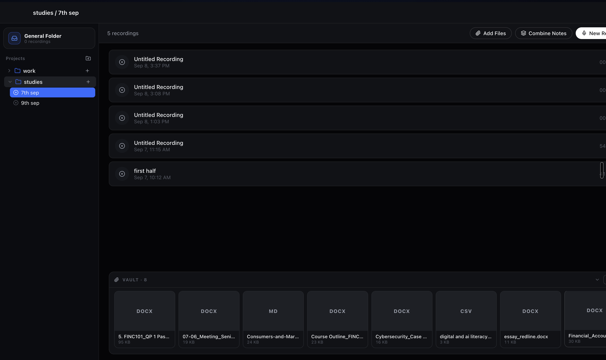

<p align="center">
  
</p>

<h1 align="center">Ovio</h1>

<p align="center">
  <strong>Local transcription. AI notes. Open source.</strong><br/>
  High-quality speech-to-text and AI-written notes that run on your Mac —<br/>
  with a system-wide shortcut to start a recording from anywhere.
</p>

<p align="center">
  <a href="#license"></a>
  <a href="https://github.com/pulakit001/ovio/releases"></a>
  
  
</p>

---



Ovio lives in your Dock and stays out of your way. Talk to it — in a meeting,
a lecture, or on a call — and it transcribes live on your machine, writes the
structured notes for you, and files everything exactly where it belongs.
Want to start without touching the app? A system-wide shortcut does that too.

## What it does

**You talk. Ovio does the rest.**

1. **Transcribes as you talk** — high-quality STT runs on your Mac
   (Parakeet-TDT v3, 25 languages). Words stream in live; nothing leaves the
   machine.
2. **Writes the notes** — stop, and the AI drafts a structured note: a short
   overview, the key points, a detailed section per theme. Then the chat
   answers from the transcript itself — ask *"what did we decide?"* and get
   a grounded answer, not a guess.
3. **Files itself** — right project, or the permanent General Folder on the
   go. `⌘K` finds the moment you're thinking of, across every transcript.
4. **Starts from anywhere, if you want it to** — `⌘⇧Space` begins a recording
   from any app, any screen (alternate: `⌥⇧Space` · safety chord: `⌘⇧U`).
   Every chord is rebindable in Settings, and the whole thing switches off
   with one toggle. It's a convenience, not a requirement — Ovio works
   just as well straight from the Dock.

## How the notes are written

Not a wall of text — a structured note with a summary at the end. The engine
behind it:

- **Context-aware pipeline** — the engine reads the model's real context window
  first. Most recordings are a single call; hour-long lectures chain small
  digest passes only as far as the math requires.
- **Gemini-powered, with fallbacks** — Gemini Flash-Lite by default, automatic
  multi-key and multi-model fallback, OpenRouter as a second provider.
- **Chat that cites your audio, not its imagination.**



## The local mode — the thing Ovio is built around

**Ovio works with zero cloud accounts, zero API keys, zero dollars.**

- **On-device speech-to-text** — NVIDIA Parakeet-TDT v3 streams transcriptions
  locally (25 languages, ~6.3% avg WER), with whisper.cpp as a fallback.
  Models download inside the app with live progress.
- **On-device notes** — point Ovio at your own [Ollama](https://ollama.com)
  and the notes engine runs on your hardware: it probes your models, picks
  sensible defaults, keeps them warm.
- **On-device everything else** — keys are AES-256-GCM encrypted locally;
  recordings, transcripts, and notes never leave your disk; the whole library
  exports as one JSON file you own.

Cloud when you want it. Fully local when you don't. Same app.

## Organized without the organizing

- **A permanent General Folder** catches everything recorded from anywhere.
- **Projects → subprojects**, with drag-and-drop transfer between any folders.
- **`⌘K` search** finds the moment you're thinking of, across every transcript.
- **Live analytics**: meetings, time captured, AI summaries, weekly activity.

## The Vault

Inside any subproject, **Add Files** takes PDFs, images, Markdown, CSV —
whatever belongs next to your recordings. The Vault keeps them in a collapsed
tray at the bottom of the folder: expand it, scroll it, open anything
full-screen. Recordings and their source material, in one place.



## Open source

**Every line of Ovio is [MIT-licensed](LICENSE) and on GitHub.** No account,
no subscription, no telemetry. Read the code, audit the network calls, fork
it, ship your own build — that's the point.

## Install

**[Download Ovio-mac.dmg](https://github.com/pulakit001/ovio/releases/latest/download/Ovio-mac.dmg)**
(≈100 MB, Apple Silicon) — or browse all files on the
**[Releases page](https://github.com/pulakit001/ovio/releases)**.

1. Open the DMG, drag **Ovio** into **Applications**, eject the DMG.
2. Launch from Applications — **never from inside the DMG window**.

> **The "Apple could not verify Ovio" dialog — read this once.** The build is
> not yet notarized (no paid Apple Developer certificate), so macOS shows a
> malware warning on first open. It is expected and harmless: Ovio is MIT
> open source. On the dialog click **Done** — *never* "Move to Trash" — then
> either click **Open Anyway** in System Settings → Privacy & Security, or run:
>
> ```bash
> xattr -cr /Applications/Ovio.app
> ```
>
> After that, Ovio opens normally every time. The dialog disappears forever
> once the app is Developer-ID signed — the build pipeline notarizes
> automatically whenever a certificate is configured.

**Local STT models** download on demand in-app (Parakeet ≈ 2.5 GB with runtime;
Whisper Small ≈ 466 MB, Turbo ≈ 1.6 GB) — the app itself stays small.

## Build from source

```bash
git clone https://github.com/pulakit001/ovio.git
cd ovio && npm install
npm run electron:dev      # development
npm run electron:build    # DMG + zip in /release
```

### Architecture

```
├── electron/              Main process
│   ├── main.cjs           Windows, global shortcuts, ambient panel, Dock
│   ├── settings.cjs       Encrypted settings + key store (AES-256-GCM)
│   ├── whisper.cjs        whisper.cpp engine (chunked STT)
│   ├── parakeet.cjs       Parakeet-TDT lifecycle over IPC
│   └── parakeet_server.py Localhost streaming sidecar (FastAPI/WebSocket)
├── src/
│   ├── App.jsx            Shell, routing, global state
│   ├── screens/           Dashboard · Recorder · Settings · Onboarding
│   ├── components/        CommandPalette (⌘K) · TransferModal
│   ├── hooks/             useTranscription · useAutoNotes · usePersistence
│   ├── services/          ai.js (router) · geminiCore · ollama · openrouterCore
│   └── ui/                theme · animation primitives
└── build/icon/            Full macOS icon set (16px → 1024px, icns)
```

**Stack:** Electron · React 18 · Vite · whisper.cpp · Parakeet-TDT v3 (NeMo) · Gemini / OpenRouter / Ollama

## Testing

```bash
npm run test:parakeet    # end-to-end engine protocol test
```

## License

[MIT](LICENSE) © Snippetz Labs

---

<p align="center"><sub>Built by the team at <strong>Snippetz Labs</strong></sub></p>
